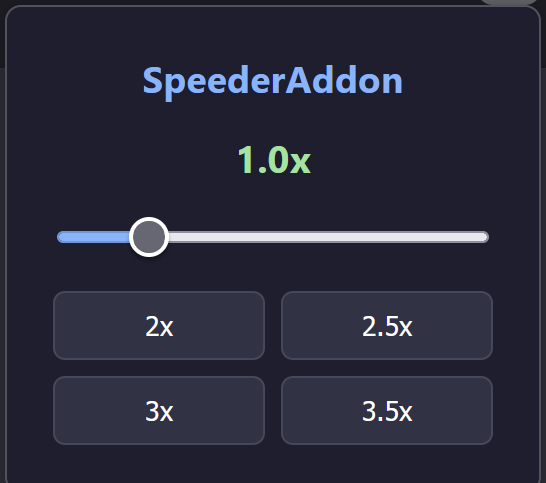

# SpeederAddon

## Firefox addon

### Comfortable tool for setting video playback rate on any site

### Addon finds "video" element on the current tab and sets playback rate,

### 

### Setup:

1. git clone https://github.com/Cheengizs/SpeederAddon
2. go to 'about:debugging' in firefox
3. select 'This Firefox'
4. select 'manifest.json' in downloaded folder

> **playerzored - f u**
> — _Cheengizs_

